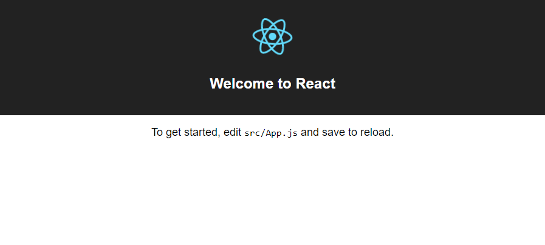
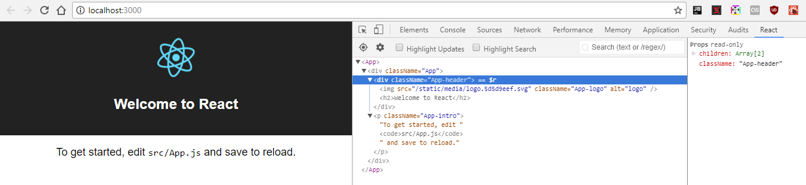

# How to: Setup a React development environment on Mac

Guide to installing the tools required to run React+Webpack (via create-react-app) on Mac

> **Attention! Before getting started!** This guide was tested on Mac OS 10.11 using Node v6.11.1 and npm 5.3.0. 

## Steps

1. Running the Terminal.app and Installing Homebrew
2. Install Node.js
3. Upgrading **npm** (optional step)
4. Installing **create-react-app**
5. Creating a basic React application
6. Starting your React application
7. Editing your React application 
8. Releasing your React application to the public

---

### 1. Opening Terminal.app

First, you'll need to download and install the Homebrew. Using Spotlight (option+space), search for **Terminal.app** and hit _return_ top open it. If you have not already installed Homebrew before, visit https://brew.sh and run the command available on their website. Alternatively, copy and paste this into your terminal to install Homebrew. This could take a while.

```bash
/usr/bin/ruby -e "$(curl -fsSL https://raw.githubusercontent.com/Homebrew/install/master/install)"
```

Next, install XCode's command line tools by typing in:

```bash
xcode-select --install
```

Once these are installed, you can move on to...

---

### 2.  Install Node.js

Once you've installed Homebrew, you need to install the **Node Version Manager (NVM)**. Run the following command in your terminal:

```bash
curl -o- https://raw.githubusercontent.com/creationix/nvm/v0.33.11/install.sh | bash
```

You will now need to reload your bash environment/terminal window or `source .bash_profile`. Once done, you can install the LTS (Long-term support) version of Node.js.

```
nvm install --lts
```

This will install the LTS version of Node and npm (as of writing, 8.11.4 is LTS but this will change over time).

```
Installing latest LTS version.
Downloading and installing node v8.11.4...
Downloading https://nodejs.org/dist/v8.11.4/node-v8.11.4-darwin-x64.tar.gz...
######################################################################## 100.0%
```

Now, you need to enable/use this version:

```
nvm use 8.11.4
```

> Alternative you can create a `.nvrmc` file for each project that specifies a version. See the official documentation for details: https://github.com/creationix/nvm#nvmrc

Once it is done, verify that everything is installed correctly. In your terminal, type in:

```bash
node -v
```

You should see output similar to:

```bash
$ node -v
v8.11.4
```

This verifies that we have Node.js version 6.11.1 installed on our computer. Next, type in:

```bash
npm -v
```

This verifies that the _node package manager_ (npm) has been installed. You should see output similar to:

```bash
$ npm -v
5.6.0
```

---

### 3. Upgrading npm (optional, feel free to skip)

We want to make sure that the _node package manager_ (npm) is up to date. Run the following terminal command:

```bash
npm i -g npm@latest
```

In english, we are telling the computer the following: _node package manager: (i)nstall (-g)lobally on my computer [so it can be used anywhere] the latest version of npm [yourself].

This could take a few moments to run. Once it is complete, you'll see output similar to the following (but it may not match exactly.. each computer is different):

```
npm i -g npm@latest
+ npm@5.3.0
updated 1 package in 25.406s
```

---

### 4. Installing create-react-app

There is a boilerplate already written for react - it is called _create-react-app_. It is available, like many other scripts, on the _node package manager (npm)_. We can install it using the `npm i` command again. Run the following code in your terminal:

```bash
npm i -g create-react-app
```

This can also take a few moments - `npm` is having to install React and other tools on your computer. Once complete, you'll see output similar to this:

```bash
$ npm install create-react-app -g
/Users/James/.npm/create-react-app -> /Users/James/.npm/node_modules/create-react-app/index.js
+ create-react-app@1.3.3
updated 1 package in 41.553s
```

---

### 5. Creating a basic React application

> You're over halfway there! Keep it up!

It is time for you to finally create a React application from the `create-react-app` boilerplate. When you use `create-react-app`, you should specfiy a name for your application. It will create the following file structure for you in a folder with the name of your app. That structure looks like this:

```bash
├── README.md
├── package.json
├── public
│   ├── favicon.ico
│   └── index.html
└── src
    ├── App.css
    ├── App.js
    ├── App.test.js
    ├── index.css
    ├── index.js
    └── logo.svg
```

The `index.html` has all of the App.js code _injected_ into it using the tools that `create-react-app` provides. It even creates start Javascript and CSS files for you. **This should make you feel awesome!**

Time for you to try it out. Run:

```bash
create-react-app hi-react
```

This creates a folder wherever you are called `hi-react`. _create-react-app_ tells you where this is installed so you can easily find it to open in your text editor. Once complete, you should see the following (or similar):

```bash
$ create-react-app hi-react
Creating a new React app in C:\Users\James\hi-react.

Installing packages. This might take a couple of minutes.
Installing react, react-dom, and react-scripts...

+ react@15.6.1
+ react-dom@15.6.1
+ react-scripts@1.0.10
added 1205 packages in 54.568s

Success! Created hi-react at C:\Users\James\hi-react
Inside that directory, you can run several commands:

  npm start
    Starts the development server.

  npm run build
    Bundles the app into static files for production.

  npm test
    Starts the test runner.

  npm run eject
    Removes this tool and copies build dependencies, configuration files
    and scripts into the app directory. If you do this, you can’t go back!

We suggest that you begin by typing:

  cd hi-react
  npm start
```

---

### 6. Starting your React application

_create-react-app_ includes a web server to test your app on. You'll need to _change directory_ (cd) into your applicaton to run it. Do this:

```bash
cd hi-react
```

And then run:

```bash
pwd
```

You should see that you your `hi-react` folder:

```bash
$ pwd
/c/Users/James/hi-react
```

Now, start your application using `npm` --

```bash
npm run start
```

You'll be informed that your application is running. It _should_ also open up a new web browser pointing to the correct (but temporary) URL.

```bash
$ npm run start

> hi-react@0.1.0 start C:\Users\James\hi-react
> react-scripts start

Starting the development server...

Compiled successfully!

You can now view hi-react in the browser.

  Local:            http://localhost:3000/
  On Your Network:  http://192.168.56.1:3000/

Note that the development build is not optimized.
To create a production build, use npm run build.
```

You can also browse tothe _local_ address provided. In this case, you could point your browser to [http://localhost:3000/](http://localhost:3000/)

You should see the React starter page.



---

### 7. Editing your React application

You'll notice that you're encouraged to edit the `src/App.js` file. This is where you can shine! For now, just edit the text in front of you and hit save in your editor of choice. Refresh your application in the browser and you'll see your changes are updated.  

You should also take a moment to install the [React Developer Tools Extension for Chrome](https://chrome.google.com/webstore/detail/react-developer-tools/fmkadmapgofadopljbjfkapdkoienihi?hl=en). 

Once they are installed, you will have a new _tab_ under DevTools to the far right. If you select it, you can see React components clearly.



> If you ever need to stop your server, press `control + c` at the same time. This will stop _any_ terminal process.

---

### 8. Releasing your React application to the public

Once you are satisfied with your application, it is time to bundle your code together ready for the web. `create-react-app` will bundle your code, remove whitespace, obfuscate it so it is harder for others to read, and make it take up less space. Press `control + c` at the same time to exit your React server if you have not already. Once you have done that, you will see that you can enter more commands in your terminal. Run the following:

```bash
npm run build
```

This process can take a few moments. Once it is complete, the _entire_ contents of your website will be available in the **build** subdirectory of your project. It will contain the following files and folders:

```bash
asset-manifest.json  favicon.ico  index.html  manifest.json  service-worker.js  static/
```

All of these files and folders can then be uploaded to a website for production or be distributed to clients for a final release.


*fin*
